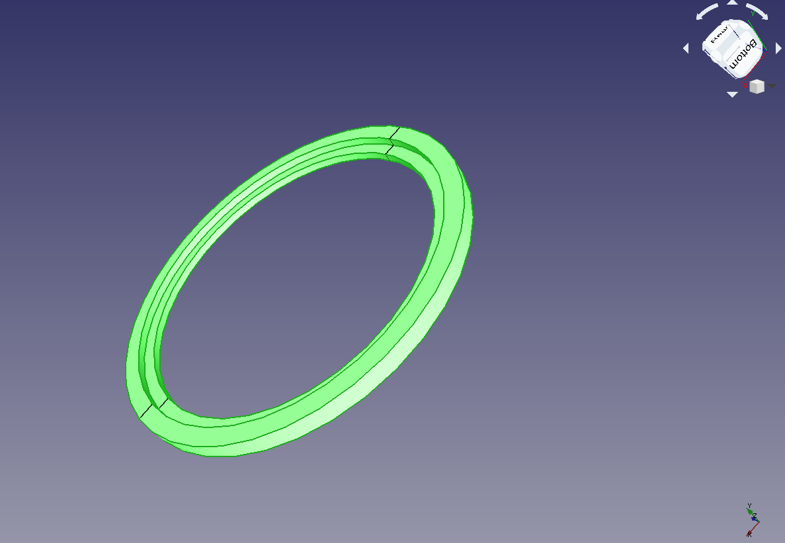

# Optomechanics
This is my repo for my optomechanics studies and developments.

The results of this development is powered by Freecad.

1. ### Ring mount for single lens

Single lens mounting can be the first step to have a good optical alignment. In this example, a stepped ring is used to mount a single lens by gravity. The ring design is based on parameters. The part is designed with rotational symmetry.

In the next picture there are a list of measurements which are parametrized within the design. The list of parameters is as follow:

* r1 = 185 mm (see first diameter = 2*r1)
* r2 = 200 mm
* r3 = 220 mm
* h1 = 10 mm (internal height)
* h2 = 20 mm (external height)

